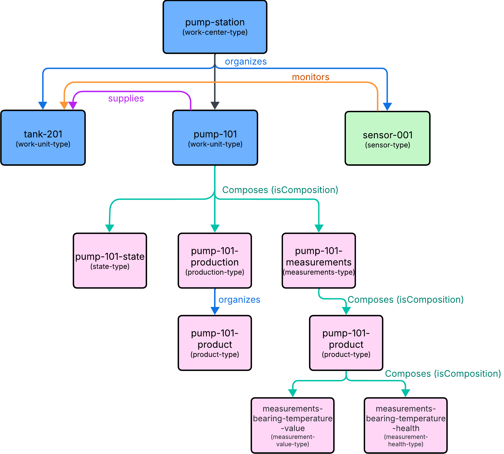

# Understanding the Demo Model

The [mock data Demo Model](server/data_sources/mock) illustrates the complexity of relationships that i3X supports -- both the required and optional. Its critical to understand the differences between each, and the implications of supporting them:

- Hierarchical Relationships: one object *organizes* one or more other objects
- Composition Relationships: one object is *made up of* one or more other objects
- Graph Relationships: *any* other relationship between objects

i3X Implementations must support Hierarchical and Composition Relationships. Graph relationships are optional in the RFC.

## Relationship Types in Brief

### Hierarchical Relationships

This relationship type is commonly used in an ISA-95 asset hierarchy. UNS implementations using MQTT also often naturally fall into this pattern due to the hierarchical nature of the topic structure.

Hierarchical relationships are used to illustrate how an object is related to other objects: each child object may have a single parent; each parent object may have many child objects.

In a manufacturing operation, a "Plant" object may have many "Lines". What's key is that a hierarchical relationship is between two independent objects.

### Composition Relationships

This relationship type is when an object typically requires another object as part of its definition. A machine that cannot function without an internal component would usually be a composition. However, an information model may still need to identify the internal component, so its data is still defined as a separate, sub-object of the parent machine.

Composition may also be known as encapsulation. Encapsulation is an important Object Oriented Programming concept that indicates independence of, and sometimes the hiding of, a structure. Think of a person: we interact with each other as whole individuals, but a surgeon needs access to internal organs. Composition relationships work the same way — most consumers see the whole object, but specialists can access its internal parts.

When modeling information, its important to be able to express an composition relationship between two objects to indicate how objects are encapsulated.

### Graph Relationships

This relationship type encompasses any relationship not expressed by the other two relationship types. Graph relationships in i3X are bi-directional "edges" between "node" objects. Each graph relationship has an inverse: a pump has a "suppliesTo" relationship with a tank, therefore conversely, a tank has a "suppliedBy" relationship with a pump.

While parent-child relationships *can* be expressed in this fashion, those hierarchical relationships are common enough that they have their own pre-defined relationship type. Graph relationships, then express the full richness of non-hierarchical interactions in manufacturing. They can span a single process unit, articulating the physics or flow of the operation, or across supply chains, articulating how parts or raw materials come together to form a finished good.

## Demo Model Relationships



This diagram shows each of the relationship types explored in a sample operation:

- "Organizes" (Blue lines) are Hierarchical Relationships
- "Composes" (Green lines) are Composition Relationships
- All Others (Purple and Orange lines) are Graph Relationships

One can readily see that "tank-201" has multiple lines going into it. Only one of those lines can represent a "parent" (a hierarchical relationship) but the other lines are important to understanding how the operation works. Since we cannot have multiple parents, we must use graph relationships to capture this other knowledge.

And while the average data consumer may be interested in all the pump measurement data as a single object (encapsulation), an analysis tool may want a way to subscribe to only part of that data. The composition of "pump-101" allows for both interactions.

## i3X Relationship Expression

i3X payload formats support all of these relationship types. The following code exercpts shows how each relationship is serialized.

- Hierarchical relationships from a parent organizing children:

```
{
    "elementId": "pump-station",
    "displayName": "pump-station",
    "namespaceUri": "https://isa.org/isa95",
    "typeId": "work-center-type",
    "parentId": "/",
    "isComposition": false,
    "relationships": {
      "HasParent": "/",
      "HasChildren": [
        "pump-101",
        "tank-201",
        "sensor-001"
      ]
    }
}
```

- Hierarchical relationships from a child identifying its parent:

```
{
    "elementId": "pump-101-state",
    "displayName": "pump-101 State",
    "typeId": "state-type",
    "namespaceUri": "https://abelara.com/equipment",
    "parentId": "pump-101",
    "isComposition": false
}
```

- Composition relationships showing an object encapsulating its members:

``` 
{
    "elementId": "pump-101-measurements",
    "displayName": "pump-101 Measurements",
    "namespaceUri": "https://abelara.com/equipment",
    "typeId": "measurements-type",
    "parentId": "pump-101",
    "isComposition": true,
    "relationships": {
      "ComponentOf": "pump-101",
      "HasComponent": [
        "pump-101-bearing-temperature"
      ]
    }
}
```

- Composition relationships showing an encapsulated member related to the object that encapsulates it:

```
{
    "elementId": "pump-101-state",
    "displayName": "pump-101 State",
    "typeId": "state-type",
    "parentId": "pump-101",
    "isComposition": false,
    "namespaceUri": "https://abelara.com/equipment",
    "relationships": {
      "ComponentOf": "pump-101"
    }
}
```

- Graph relationships shown in one direction between two objects:

```
{
    "elementId": "sensor-001",
    "displayName": "TempSensor-101",
    "namespaceUri": "https://thinkiq.com/equipment",
    "typeId": "sensor-type",
    "parentId": "pump-station",
    "isComposition": false,
    "relationships": {
      "Monitors": "tank-201"
    },
    "engUnit": "CEL",
    "calibrationDate": "2025-01-15"
  }
```

- Graph relationships shown in the reverse direction between two objects:

```
{
    "elementId": "tank-201",
    "displayName": "tank-201",
    "namespaceUri": "https://isa.org/isa95",
    "typeId": "work-unit-type",
    "parentId": "pump-station",
    "isComposition": false,
    "relationships": {
      "SuppliedBy": "pump-101",
      "MonitoredBy": "sensor-001"
    }
}
```
